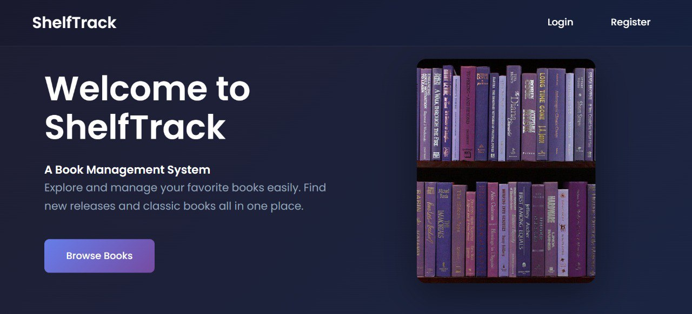
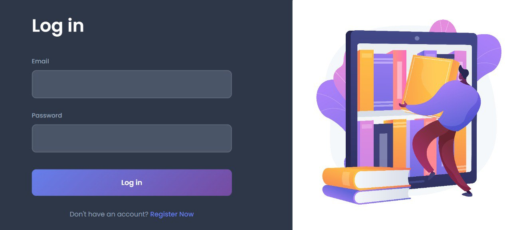
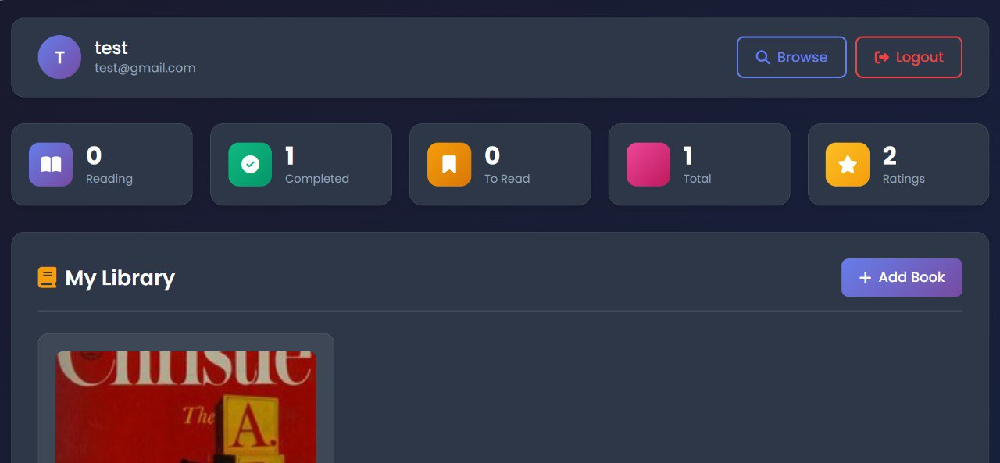
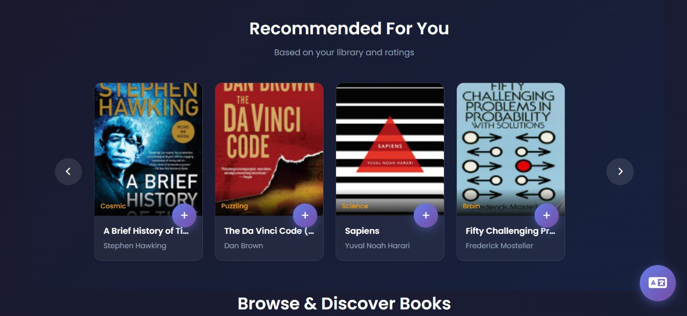
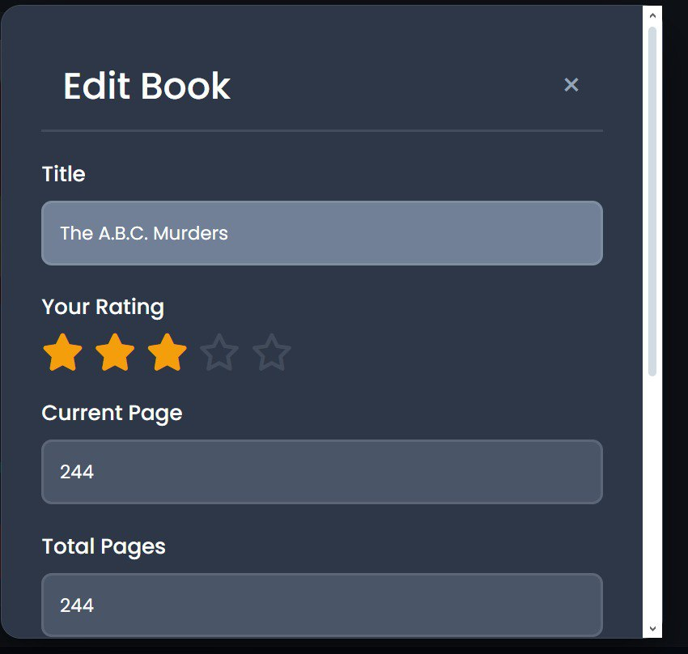

## BookTracker – Spring Boot Web Application

"ShelfTrack" BookTracker is a web application developed for academic purposes, aimed at practicing the design and deployment of a Spring Boot–based application using REST APIs, authentication, database integration, and containerized services with Docker.

The project combines a server-side rendered web interface with backend REST services and external authentication.

-----------------------------------------------------------------------------------------------------------------

## Technologies Used:

-Spring Boot

Backend business logic

REST API development

-Thymeleaf

Server-side HTML rendering

-CSS

Application styling

-Keycloak

Authentication and authorization (OAuth2 / JWT)

-MySQL

Relational database

-Python (Flask)

Auxiliary AI service

-Docker & Docker Compose

Containerization and service orchestration

-----------------------------------------------------------------------------------------------------------------

## Application Overview :

The application is composed of multiple services:

🔹 book-service

Spring Boot REST API responsible for:

Business logic

Database access

Exposing secured endpoints consumed by other services

🔹 vitrine

Spring Boot web application using Thymeleaf templates.

Renders HTML pages on the server

Communicates with:

book-service via REST API

ai-service via REST API

🔹 ai-service

Python (Flask) service used for AI-related features, exposed through REST endpoints.

🔹 keycloak

Authentication and authorization server responsible for:

User authentication

Token issuance

Access control

🔹 mysql

Relational database used by backend services.

All services are managed and started using Docker Compose.
-----------------------------------------------------------------------------------------------------------------

## Authentication & Authorization

Authentication and authorization are handled using Keycloak.

Realm: booktracker

Protocol: OpenID Connect (OIDC)

Token type: JWT

Authentication Flow: 

-Users authenticate via Keycloak

-Keycloak issues a JWT access token

-The web application includes the token in requests

-Backend REST services validate the token for protected resources
-----------------------------------------------------------------------------------------------------------------

## Running the Project:
 
Prerequisites

-Docker

-Docker Compose

  Setup & Run:
git clone https://github.com/USERNAME/Book-Tracker.git
cd Book-Tracker
cp .env.example .env
docker compose build
docker compose up

-----------------------------------------------------------------------------------------------------------------
 Access URLs
Service	URL
Web Application	http://localhost:8080

Backend REST API	http://localhost:8081

Keycloak Admin Console	http://localhost:8180

-----------------------------------------------------------------------------------------------------------------

##  Application Screenshots

Screenshots are stored in the `screenshots/` folder and displayed below.

### Home Page

### Login Page

### Dashboard

### Recommendations

### Book rating

### Summary

## Team

This project was developed collaboratively by:

Rihab Bouchair and Ines Mecheter

## Notes

This is a learning / academic project

The project focuses on REST APIs, security, and service integration

Secrets and credentials are managed using environment variables and are not committed

The architecture can be extended with additional features and improvements
